# 海洋伙伴 / 儿童海洋涂鸦

这是一个关于“孩子画出来的海洋伙伴，真的游进海里”的小型探索项目。

孩子先选择一个海洋动物模板，用点按分区的方式给它涂色。完成后，作品会被送进一个动态海洋世界里，和其他小鱼、海草、气泡一起慢慢游动。项目面向 3-9 岁儿童，优先考虑 Pad 横屏、触控大按钮、低文字负担和本地离线体验。

这个项目的产品设计与开发探索使用 [cxDesinger](https://github.com/zuoliang0/cxDesinger) 完成。它不是一个商业化产品模板，更像是一次把 AI 辅助产品设计、视觉稿、切片资产和前端实现串起来的实验。

## 设计稿 vs 当前实现

下面左侧是设计探索阶段生成的页面稿，右侧是本地应用在 1024x768 横屏视口下截取的运行截图。这个对比也是这个项目想保留下来的部分：它不是只展示“最好看的最终结果”，也展示 AI 辅助设计到工程实现之间还有多少距离。

| 页面 | 设计稿 | 当前实现 |
| --- | --- | --- |
| 主页 | 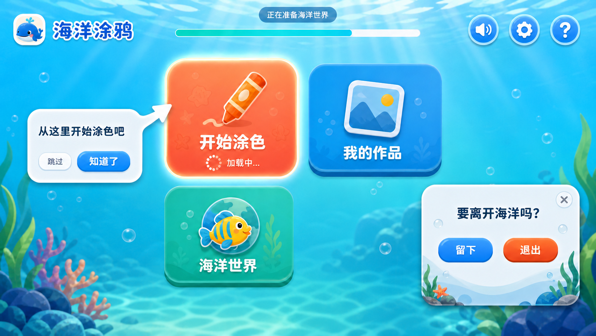 | 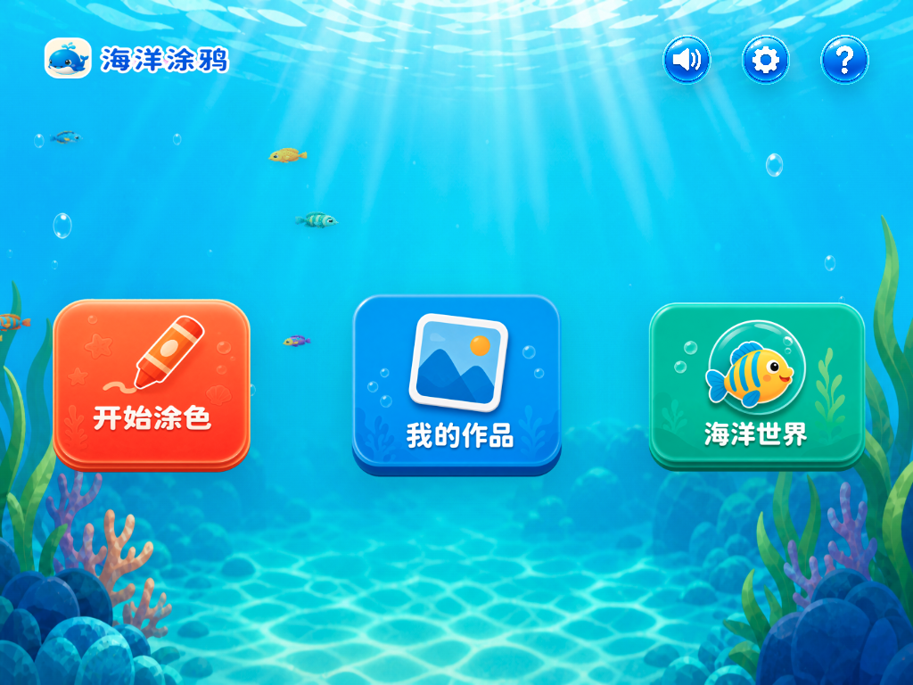 |
| 模板选择 | 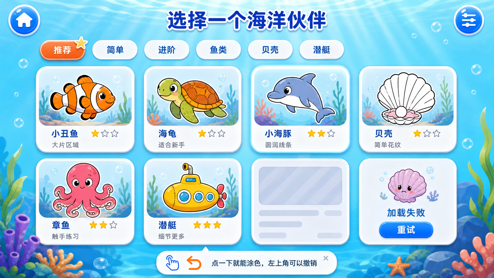 | 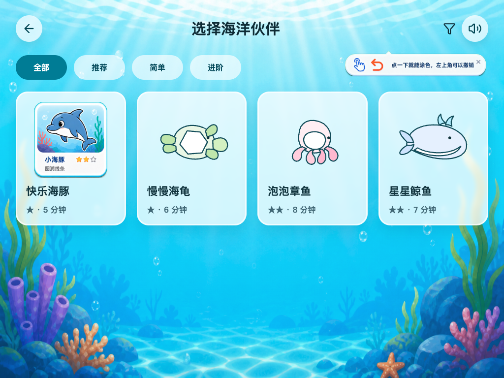 |
| 涂色编辑器 | 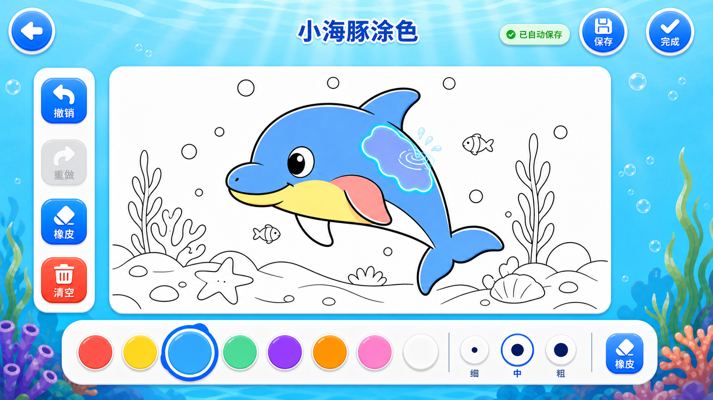 | 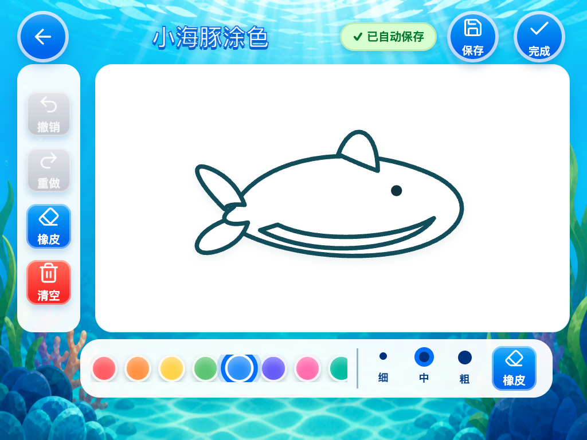 |
| 完成预览 | 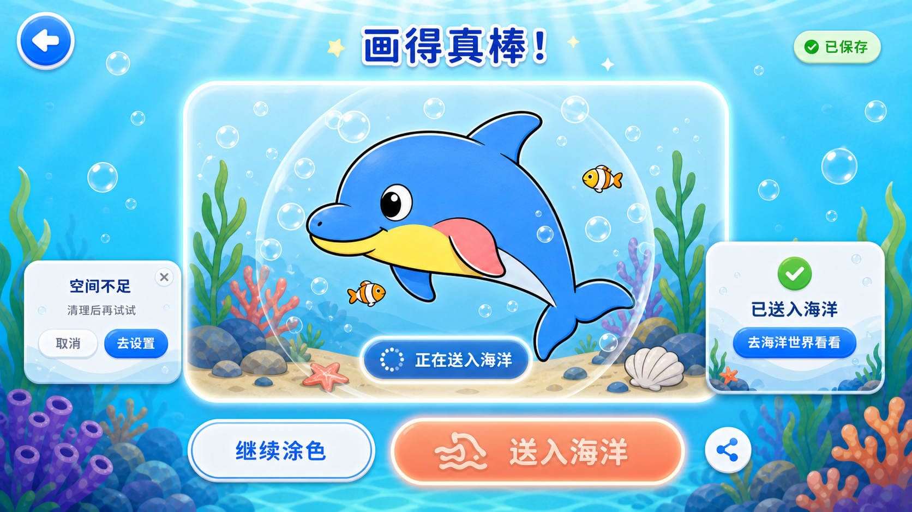 | 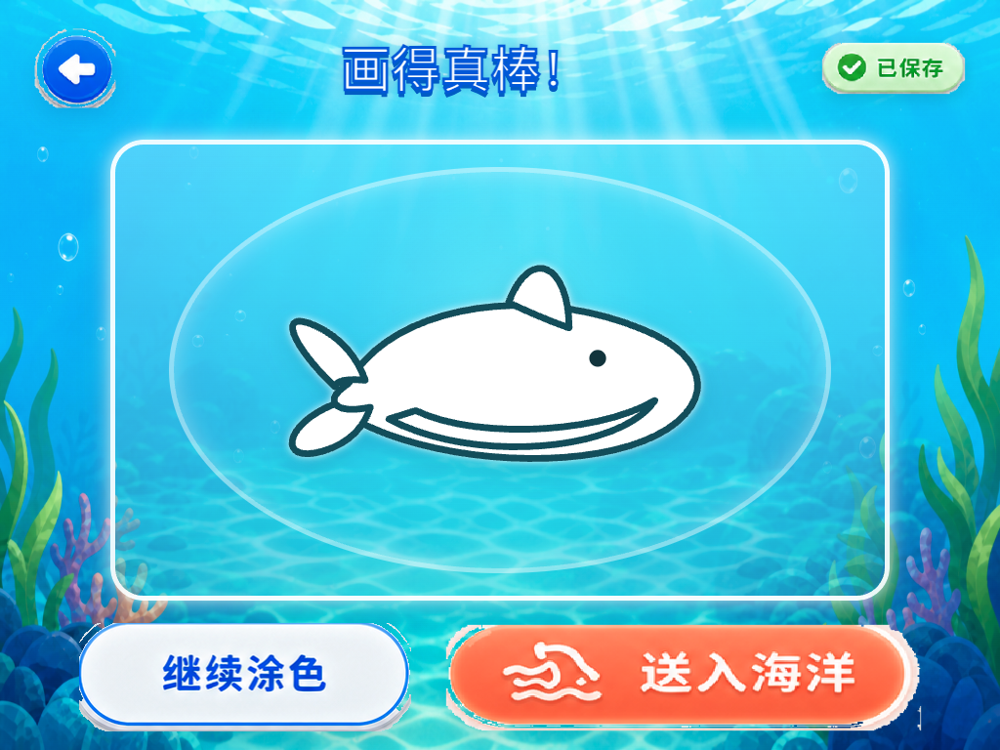 |
| 海洋世界 | 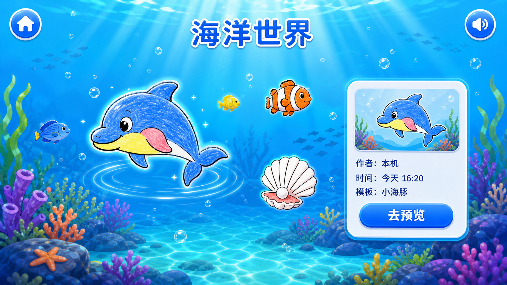 | 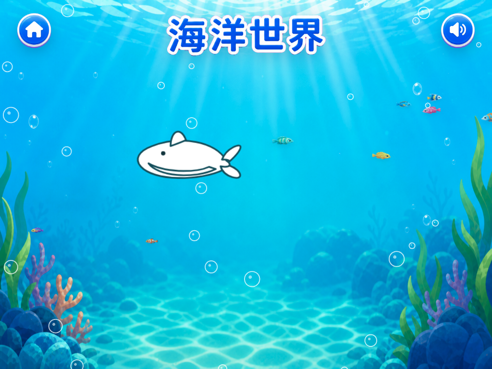 |
| 我的作品 | 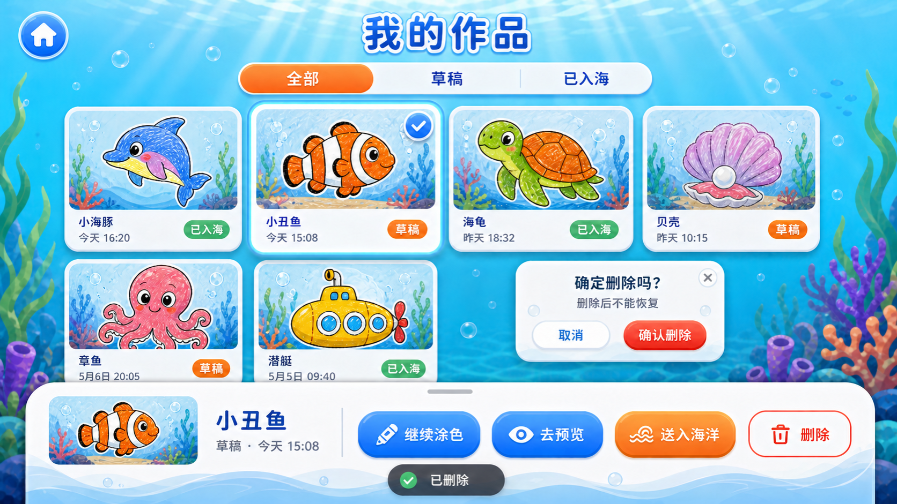 | 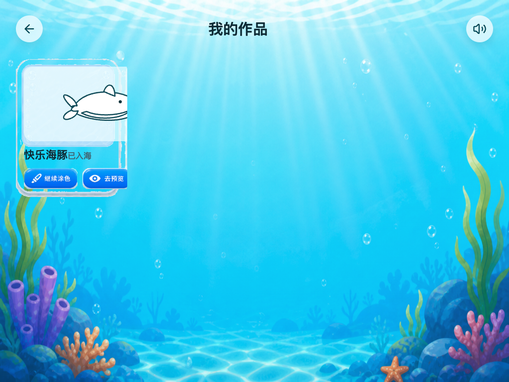 |
| 设置与帮助 | 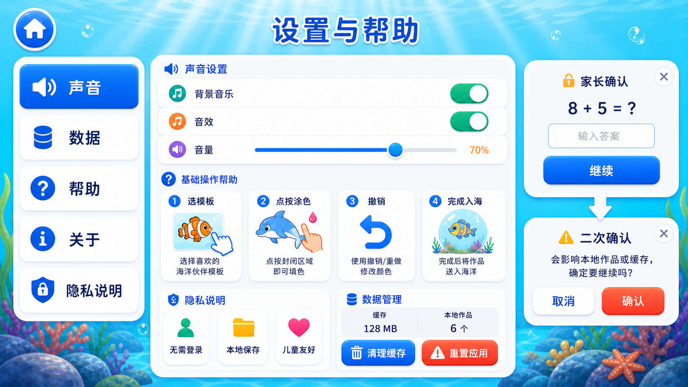 | 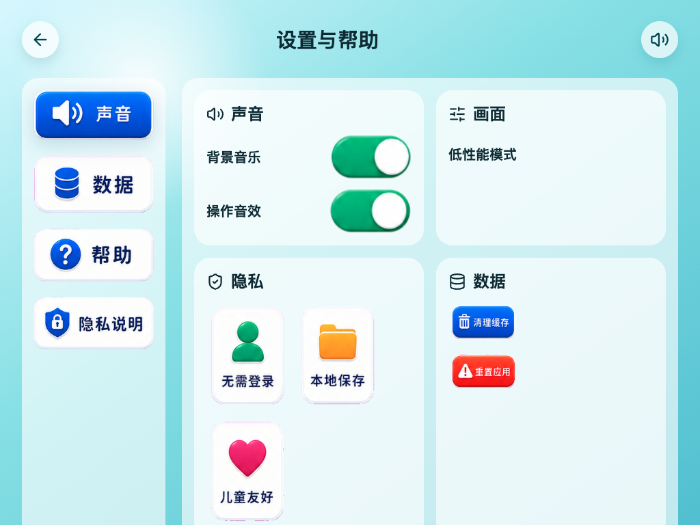 |

## 关于 AI 辅助的局限

这个项目大量使用 AI 参与产品规划、界面设计、资产切片和代码实现，效率很高，但并不意味着可以完全自动得到一个成熟产品。目前能明显看到几个局限：

- 设计稿到代码的视觉还原仍需要人工判断，尤其是间距、层级、动画节奏和儿童触控细节。
- 生成资产会带来冗余，切片命名、复用关系和资源体积都需要后续整理。
- AI 更擅长快速搭出可运行路径，但对真实儿童使用场景下的误触、耐心、理解成本，还需要真实测试来校准。
- 当前实现是 MVP 原型，一些交互和动态效果还偏简化，不能把它当成完成度很高的生产级应用。

## 它现在能做什么

- 从主页进入模板选择、我的作品、海洋世界和设置页。
- 选择海洋伙伴模板，进入涂色编辑器。
- 在 SVG 分区上点按填色，使用调色盘、撤销重做和清空确认。
- 自动保存作品草稿，本地保存到浏览器 IndexedDB。
- 完成后进入预览页，把作品送入海洋。
- 在海洋世界中展示已经入海的作品伙伴。
- 在作品库继续编辑或删除本地作品。
- 在设置页管理声音、低性能模式、帮助说明和本地数据。

项目默认不做账号、云同步、社交分享，也不接入第三方追踪。作品只保存在本地浏览器里。

## 为什么做这个

我想验证一个简单但有趣的产品路径：

1. 儿童创作过程足够轻，不需要复杂画笔学习成本。
2. 完成作品后不只是静态保存，而是进入一个“活着”的场景。
3. 视觉稿、切片资产、页面规划和代码实现可以围绕同一份产品事实持续迭代。

所以这个仓库里除了代码，也保留了 PRD、页面规划、技术方案、设计稿和切片资产。它适合拿来观察一个 AI 辅助设计开发项目从想法到可运行 MVP 的过程。

## 技术选型

- Vite + TypeScript
- React + React Router
- Zustand
- IndexedDB + LocalStorage
- PixiJS
- lucide-react

## 本地运行

```bash
npm install
npm run dev
```

然后打开终端里 Vite 输出的本地地址。

## 验证命令

```bash
npm run typecheck
npm run lint
npm run build
```

## 项目结构

```text
.
├── assets/          # 页面设计稿、切片资产、精灵图
├── docs/            # PRD、页面规划、技术方案、功能清单
├── src/
│   ├── components/  # 通用组件
│   ├── data/        # 模板配置
│   ├── lib/         # 存储与作品渲染逻辑
│   ├── pages/       # 页面路由
│   └── store/       # 应用状态
├── pages.json       # 页面、路由、设计稿和资产索引
└── AGENTS.md        # 项目协作规范
```

## 文档

- `docs/prd.md`：产品目标、用户旅程和 MVP 范围。
- `docs/page-plan.md`：页面路由、交互和关键状态。
- `docs/technical-plan.md`：前端架构、数据结构和渲染方案。
- `docs/feature-plan.md`：模块级功能规划。
- `docs/feature-list.md`：可拆票功能清单。
- `pages.json`：页面设计稿、UI prompt 和资产索引。

## 隐私

项目默认不采集个人信息。作品、涂鸦轨迹、导出纹理和设置都保存在用户浏览器本地。清空本地数据会删除已保存作品。

## License

[MIT](./LICENSE)
